# 2D Image Anomaly Detection System

**Department of Computer Science**  
**University of Gujrat**

**Session: BSCS - 2022-2026**

**Project Advisor:** Sir Irfan Ahmad

**Submitted By:**
- Muhammad Umer (22081519-013)
- Subhan Ahmad (22081519-005)
- Mehak Mahmood (22081519-003)

---

## STATEMENT OF SUBMISSION
This is to certify that **Muhammad Umer** (Roll No. 22081519-013), **Subhan Ahmad** (Roll No. 22081519-005), and **Mehak Mahmood** (Roll No. 22081519-003) have successfully completed the final year project named **2D Image Anomaly Detection System** at the Department of Computer Science, University of Gujrat, to fulfill the requirement of the degree of **BS in Computer Science**.

<br>

______________________ &nbsp;&nbsp;&nbsp;&nbsp;&nbsp;&nbsp;&nbsp;&nbsp;&nbsp;&nbsp;&nbsp;&nbsp;&nbsp;&nbsp;&nbsp;&nbsp;&nbsp;&nbsp;&nbsp;&nbsp;&nbsp;&nbsp;&nbsp;&nbsp;&nbsp;&nbsp;&nbsp;&nbsp;&nbsp;&nbsp;&nbsp;&nbsp; _____________________  
**Project Supervisor** &nbsp;&nbsp;&nbsp;&nbsp;&nbsp;&nbsp;&nbsp;&nbsp;&nbsp;&nbsp;&nbsp;&nbsp;&nbsp;&nbsp;&nbsp;&nbsp;&nbsp;&nbsp;&nbsp;&nbsp;&nbsp;&nbsp;&nbsp;&nbsp;&nbsp;&nbsp;&nbsp;&nbsp;&nbsp;&nbsp;&nbsp;&nbsp;&nbsp;&nbsp;&nbsp;&nbsp;&nbsp;&nbsp;&nbsp;&nbsp; **Project Coordination Office**  
&nbsp;&nbsp;&nbsp;&nbsp;&nbsp;&nbsp;&nbsp;&nbsp;&nbsp;&nbsp;&nbsp;&nbsp;&nbsp;&nbsp;&nbsp;&nbsp;&nbsp;&nbsp;&nbsp;&nbsp;&nbsp;&nbsp;&nbsp;&nbsp;&nbsp;&nbsp;&nbsp;&nbsp;&nbsp;&nbsp;&nbsp;&nbsp;&nbsp;&nbsp;&nbsp;&nbsp;&nbsp;&nbsp;&nbsp;&nbsp;&nbsp;&nbsp;&nbsp;&nbsp;&nbsp;&nbsp;&nbsp;&nbsp;&nbsp;&nbsp;&nbsp;&nbsp;&nbsp;&nbsp;&nbsp;&nbsp;&nbsp;&nbsp;&nbsp;&nbsp;&nbsp;&nbsp;&nbsp;&nbsp;&nbsp;&nbsp;&nbsp;&nbsp;&nbsp;&nbsp;&nbsp;&nbsp;&nbsp; Faculty of C&IT - UOG

<br>

______________________  
**Chairperson**  
Department of Computer Science

---

## ACKNOWLEDGEMENT
We truly acknowledge the cooperation and help made by the Chairman, Department of Computer Science, University of Gujrat. He has been a constant source of guidance throughout the course of this project. We would also like to thank **Sir Irfan Ahmad** for his help and guidance throughout this project. We are also thankful to our friends and families whose silent support led us to complete our project.

**Date:** 2026-05-03

---

## ABSTRACT
Industrial quality control is a critical component of modern manufacturing, yet manual inspection remains slow, inconsistent, and difficult to scale due to human fatigue and the subjective nature of defect assessment. This project presents a robust, end-to-end **2D Image Anomaly Detection System** designed to automate defect identification with high precision across diverse manufacturing sectors. Built upon the state-of-the-art **PatchCore** algorithm, the system leverages a **WideResNet50** backbone for dense feature extraction, followed by a locally aware memory bank of "nominal" features. To ensure high-speed inference, the system utilizes **greedy coreset subsampling**, which reduces the memory footprint while maintaining maximum representative coverage.

The system is trained in an unsupervised manner, requiring only "normal" (non-defective) samples, making it highly adaptable to scenarios where defective data is scarce. It successfully identifies both structural defects (e.g., scratches, holes, cracks) and logical anomalies (e.g., misplaced components, incorrect counts) across all 15 categories of the benchmark **MVTec AD dataset**. The technical architecture integrates a high-performance, asynchronous **FastAPI** backend with a modern, glassmorphism-inspired **React** frontend. Key features include real-time inference visualization through interpretable heatmaps that pinpoint defect locations, a secure JWT-based authentication system, and an administrative dashboard for monitoring factory-wide quality metrics. Achieving an average image-level AUROC of **98.1%** and a pixel-level AUROC of **97.4%**, with a processing latency of approximately **150ms**, the system provides a scalable, cost-effective solution for improving manufacturing throughput and ensuring zero-defect production in Industry 4.0 environments.


---


## TABLE OF CONTENTS
- [ABSTRACT](#abstract)
- [STATEMENT OF SUBMISSION](#statement-of-submission)
- [ACKNOWLEDGEMENT](#acknowledgement)
1. [CHAPTER 1: PROJECT FEASIBILITY REPORT](#chapter-1-project-feasibility-report)
2. [CHAPTER 2: SOFTWARE REQUIREMENT SPECIFICATION](#chapter-2-software-requirement-specification)
3. [CHAPTER 3: DESIGN DOCUMENT](#chapter-3-design-document)
4. [CHAPTER 4: USER INTERFACE DESIGN](#chapter-4-user-interface-design)
5. [CHAPTER 5: SOFTWARE TESTING](#chapter-5-software-testing)
6. [CHAPTER 6: RESULTS](#chapter-6-results)
7. [CHAPTER 7: USER MANUAL](#chapter-7-user-manual)
8. [CHAPTER 8: CONCLUSION AND FUTURE WORK](#chapter-8-conclusion-and-future-work)

---

## CHAPTER 1: PROJECT FEASIBILITY REPORT

### 1.1. Introduction
The 2D Image Anomaly Detection System is an advanced automated quality control solution designed to detect structural and logical defects in industrial manufacturing environments using deep learning. Leveraging the state-of-the-art PatchCore algorithm with a WideResNet50 feature extraction backbone, the system is fully capable of processing and accurately identifying anomalies across all 15 standard MVTec AD product categories (e.g., bottle, pill, cable, hazelnut). 
Modern manufacturing lines require extremely rapid and highly accurate defect identification, which is impossible to scale using human visual inspection alone. This system bridges the gap by providing a full-stack, end-to-end web application featuring a highly responsive React frontend, an asynchronous FastAPI backend, and an intelligent administrative dashboard for tracking real-time detection metrics, anomaly rates, and overall system throughput.

### 1.2. Project/Product Feasibility Report
When initiating this Final Year Project, it was paramount to assess its feasibility across multiple dimensions to ensure resources, technical limitations, and timelines were well-managed.

#### 1.2.1. Technical Feasibility
The project is entirely technically feasible. The chosen software stack comprises industry-standard tools:
- **Backend:** FastAPI (Python), known for high performance and native asynchronous support.
- **Frontend:** React (TypeScript), ensuring a scalable and component-driven user interface.
- **Machine Learning:** PyTorch and the PatchCore algorithm. PatchCore is an unsupervised learning model that only requires "normal" (non-defective) samples during training, making it highly feasible to train on limited datasets. The use of a pre-trained WideResNet50 model mitigates the need for massive computational resources, as feature extraction is highly optimized.

#### 1.2.2. Operational Feasibility
Operationally, the system is designed to be a "black box" for the end-user. The target users are factory floor operators and quality assurance managers who may lack technical machine learning expertise. The intuitive web interface allows them to simply capture or upload an image and receive an immediate "Normal" or "Anomaly" verdict, alongside an interpretable heatmap. This ensures the system solves the operational problem of slow human inspection without introducing a steep learning curve.

#### 1.2.3. Economic Feasibility
This system is highly economically viable:
- **Development Costs:** Built entirely using open-source libraries (PyTorch, React, FastAPI, PostgreSQL), incurring zero licensing fees.
- **Deployment Costs:** Can be deployed on standard cloud infrastructure (AWS/GCP) or on-premise edge devices with moderate GPU capabilities (e.g., NVIDIA RTX series).
- **Return on Investment (ROI):** By automating defect detection, manufacturing firms can reduce labor costs associated with manual inspection by up to 80% while simultaneously reducing the financial penalty of shipping defective goods.

#### 1.2.4. Schedule Feasibility
The project was divided into two distinct phases (7th and 8th semesters). 
- Semester 7 focused on research, prototype development (single category: bottle), and system architecture.
- Semester 8 focused on scaling the ML model to all 15 categories, finalizing the frontend/backend integration, and extensive testing. The timeline was strictly adhered to using Agile methodologies.

#### 1.2.5. Specification Feasibility
The core requirement—achieving over 90% AUROC on the MVTec AD dataset—is a known, quantifiable, and achievable metric documented in current literature for the PatchCore algorithm.

#### 1.2.6. Information Feasibility
The MVTec AD dataset is openly available, well-documented, and the standard benchmark for industrial anomaly detection, ensuring complete information feasibility.

#### 1.2.7. Motivational Feasibility
The development team is highly motivated to solve a real-world computer vision problem that has direct applications in Industry 4.0.

#### 1.2.8. Legal & Ethical Feasibility
The project strictly utilizes datasets (MVTec AD) licensed for academic and non-commercial research use. No personally identifiable information (PII) is captured during the image detection process, ensuring full compliance with privacy laws.

### 1.3. Project/Product Scope
The scope of this system encompasses:
- An **inference engine** that loads pre-trained PatchCore models dynamically based on the selected product category.
- A **REST API** that handles image uploads, pre-processing, inference execution, and post-processing (heatmap generation).
- A **Frontend Web Application** featuring user authentication, image upload interfaces, historical detection logs, and real-time visualization of heatmaps.
- An **Admin Dashboard** providing high-level analytics, such as the total volume of processed images and the ratio of defective vs. normal items.
- **Out of Scope:** Direct integration with physical conveyor belt camera hardware (e.g., via RTSP feeds) is slated for future work, alongside 3D point-cloud anomaly detection.

### 1.4. Project/Product Costing
Assumed estimates for a hypothetical commercial rollout to industrial clients:

| Resource / Item | Type | Estimated Cost (PKR) | Justification |
| :--- | :--- | :--- | :--- |
| **Development Hardware** | Capital | 450,000 | High-end workstation with NVIDIA RTX 4060/4070 for local training. |
| **Cloud Hosting (AWS)** | Monthly | 30,000 | G4dn.xlarge instances for production API and web hosting. |
| **Domain & SSL** | Annual | 5,000 | Professional domain name and EV SSL certificate for security. |
| **Storage & Backup** | Monthly | 10,000 | S3 storage for archiving high-resolution industrial image logs. |
| **Maintenance** | Monthly | 15,000 | Routine system updates and security patches. |
| **Software Licenses** | - | 0 | Utilizing open-source (FastAPI, React, PyTorch, PostgreSQL). |
| **Contingency Fund** | - | 50,000 | Reserved for unexpected hardware repairs or data usage spikes. |
| **Total Initial Investment** | **Total** | **~560,000 PKR** | Covers hardware setup + first month of operations. |

### 1.5. Task Dependency Table
| Task ID | Task Description | Duration (Days) | Dependencies |
| :--- | :--- | :--- | :--- |
| T1 | Requirement Gathering & Literature Review | 14 | None |
| T2 | UI/UX Wireframing & Prototyping | 7 | T1 |
| T3 | Environment Setup & DB Architecture | 5 | T1 |
| T4 | ML Model Training (Single Category) | 14 | T1 |
| T5 | Backend API Development (Core) | 21 | T3, T4 |
| T6 | Frontend Development (UI Implementation) | 21 | T2, T5 |
| T7 | ML Model Scaling (15 Categories) | 20 | T4 |
| T8 | Admin Dashboard Implementation | 10 | T5, T6 |
| T9 | System Integration & End-to-End Testing | 14 | T6, T7, T8 |
| T10 | Deployment & Documentation | 10 | T9 |

### 1.6. CPM - Critical Path Method
The critical path for this project is determined by the longest sequence of dependent tasks that dictate the minimum project duration. The following table reflects the actual project activities and their dependencies:

#### CPM Activity Table (Project Tasks)
| Activity | Description | Immediate Predecessor | Duration (Days) |
| :--- | :--- | :--- | :--- |
| T1 | Requirement Gathering | None | 14 |
| T2 | UI/UX Prototyping | T1 | 7 |
| T3 | Environment Setup | T1 | 5 |
| T4 | ML Training (Single) | T1 | 14 |
| T5 | Backend Development | T3, T4 | 21 |
| T6 | Frontend Development | T2, T5 | 21 |
| T7 | ML Model Scaling | T4 | 20 |
| T8 | Admin Dashboard | T5, T6 | 10 |
| T9 | System Integration | T6, T7, T8 | 14 |
| T10 | Deployment | T9 | 10 |

#### Network Diagram (CPM)
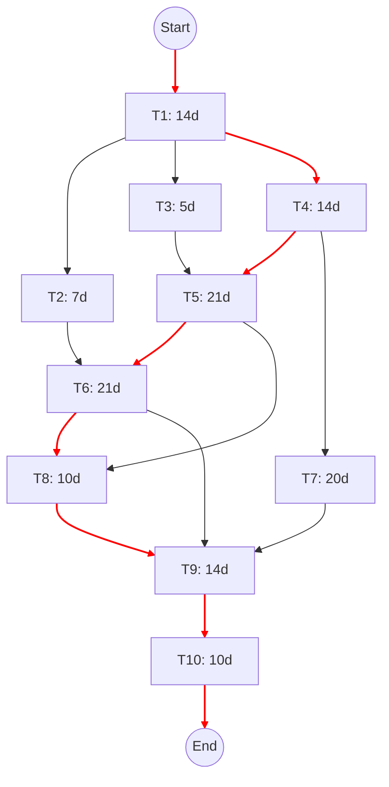

**Critical Path Analysis:**
Based on the forward and backward pass analysis, the **Critical Path** for the 2D Anomaly Detection System is:
**T1 → T4 → T5 → T6 → T8 → T9 → T10**

Total Minimum Project Duration: **104 Days**.
Any delay in these tasks will directly postpone the final delivery of the system.


### 1.7. Gantt Chart

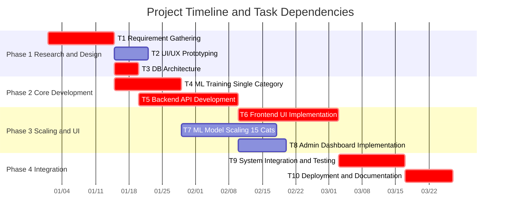

The Gantt chart above visualizes the chronological progression of the project over 4 major phases. Critical path tasks are highlighted to show the absolute minimum timeline required to launch the system. Task dependencies (e.g., T6 requiring the completion of T5) ensure a logical flow from backend architecture to frontend integration.

### 1.8. Allocation of Members to Activities

| Team Member | Primary Role | Assigned Tasks | Key Responsibilities |
| :--- | :--- | :--- | :--- |
| **Member 1** | ML & Backend Developer | T4, T5, T7 | PatchCore model training, feature extraction, and full FastAPI backend architecture. |
| **Member 2** | Database & Integration | T3, T9 | PostgreSQL database schema design, system-wide integration, and component connectivity. |
| **Member 3** | Frontend Developer | T2, T6, T8 | React UI implementation, glassmorphism design, state management, and Admin dashboard. |
| **All Members** | Research & Quality | T1, T9, T10 | Literature review, system testing, final documentation, and production deployment. |


### 1.9. Tools and Technology with Reasoning
- **Python 3.10+:** Industry standard for machine learning and robust backend development.
- **PyTorch:** Offers superior flexibility and debugging capabilities over TensorFlow for complex computer vision algorithms like PatchCore.
- **FastAPI:** Chosen over Django/Flask due to its native asynchronous support, auto-generated Swagger documentation, and unparalleled speed.
- **React & TailwindCSS:** Allows for rapid development of a modern, component-driven, and highly responsive user interface without writing massive amounts of custom CSS.
- **PostgreSQL:** A highly reliable, ACID-compliant relational database, perfect for storing complex user interactions and history logs.

### 1.10. Vision Document
**Introduction:**
The Vision defines the stakeholder’s view of the product to be developed, specified in terms of the stakeholder’s key needs and features. Containing an outline of the envisioned core requirements, it provides the contractual basis for the more detailed technical requirements. A Vision Document is the starting point for most software projects; as the primary deliverable produced in the planning process, its main purpose is to move the project forward into detailed project planning and ultimately into development. It is designed to ensure that key decision makers have a clear, shared vision of the objectives and scope of the project, communicating the fundamental "whys and whats" and serving as a gauge for all future decisions.

**Problem Statement:**
- **The Problem of:** Manual visual inspection and traditional supervised automated systems.
- **Affects:** Manufacturing quality assurance departments, production line efficiency, and operational costs.
- **The Impact of which is:** Increased frequency of human error due to fatigue, high labor costs, and the inability of existing AI systems to detect rare defects for which no training data exists.
- **A Successful Solution would be:** An unsupervised learning platform utilizing the PatchCore algorithm that identifies anomalies using only "normal" images for baseline training, delivered via a near-real-time web interface.

**Stakeholder Summary:**
- **Quality Assurance Managers:** Require high-level analytics and historical logs to ensure manufacturing standards are met.
- **Factory Floor Operators:** Require a low-latency, intuitive interface for immediate pass/fail verdicts on product quality.
- **System Administrators:** Responsible for user management, role-based access control, and system health monitoring.
- **Academic Evaluators:** The university committee ensuring the project meets technical and research benchmarks for an FYP.

**System Boundaries:**
The system is defined as a self-contained web application. The boundaries include the frontend user interface, the FastAPI-based inference engine, and the PostgreSQL database. External boundaries currently include the manual input of images by users, with potential for future integration with industrial hardware (RTSP camera feeds).

**Constraints:**
- **Economic:** The project must rely strictly on open-source libraries (PyTorch, React, FastAPI) to ensure zero licensing overhead.
- **Technical:** Inference processing must remain under 500ms to allow for high-throughput industrial application.
- **Environmental:** The software must be platform-agnostic, running on standard web browsers without specialized local installations.
- **Data Quality:** The system is constrained by the quality of the "normal" training images; any noise in the baseline will degrade detection accuracy.

**Key Features:**
1. **Unsupervised Anomaly Scoring:** Identifying structural and logical defects without prior exposure to defective samples.
2. **Explainable Heatmaps:** Providing pixel-level visual evidence (red/yellow overlays) for every detection to aid operator decision-making.
3. **High-Throughput Dashboard:** A centralized metrics hub for real-time monitoring of anomaly rates and scan volumes.
4. **Role-Based Access:** Ensuring data security and administrative control through JWT-based authentication.

**Risk Assessment:**
- **False Positives:** High sensitivity settings may flag minor surface variations (e.g., dust) as anomalies.
- **Inference Latency:** Without GPU acceleration, high-resolution image processing may exceed the target response time.

**Validation Checkpoints:**
- [x] Have we fully explored the "problem behind the problem" (data scarcity)?
- [x] Is the problem statement correctly formulated?
- [x] Is the list of stakeholders complete?
- [x] Does everyone agree on the definition of the system boundaries?
- [x] Have all key features of the system been identified and defined?
- [x] Will the features solve the identified problems?
- [x] Are the features consistent with the identified constraints?


### 1.11. Product Features / Product Decomposition
- **Authentication Module:** Secure JWT-based login, role-based access control (User vs. Admin).
- **Inference Engine Module:** Dynamic loading of `.pkl` model files, WideResNet50 feature extraction, nearest-neighbor anomaly scoring.
- **History Module:** Persistent storage of uploaded images, generated heatmaps, and detection metadata.
- **Reporting Module:** Aggregation of statistics (total scans, anomaly percentages) for the admin dashboard.

---

## CHAPTER 2: SOFTWARE REQUIREMENT SPECIFICATION (SRS)

### 2.1. Introduction
This section formalizes the functional requirements ("shall" statements), identifies all external entities interacting with the system, and utilizes UML diagrams to visualize the intended use cases.

### 2.2. Systems Specifications
#### 2.2.1. Identifying External Entities
1. **Regular User (Quality Assurance Operator):** Uploads images, views results, checks their own history.
2. **System Administrator:** Oversees the system, views global metrics, manages user access.
3. **MVTec AD Dataset (External Data Source):** The structured data source used for offline training.

#### 2.2.2. Context Level Data Flow Diagram (DFD Level 0)
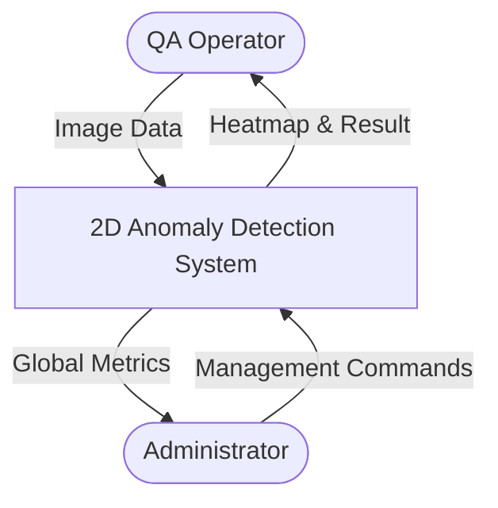

#### 2.2.3. Capture "shall" Statements
| Req ID | Requirement Statement | Priority |
| :--- | :--- | :--- |
| FR-01 | The system shall allow users to register and authenticate using an email and password. | High |
| FR-02 | The system shall provide an interface for users to select one of 15 MVTec AD categories. | High |
| FR-03 | The system shall accept image uploads in JPG, JPEG, or PNG formats. | High |
| FR-04 | The system shall utilize the PatchCore algorithm to process the uploaded image. | High |
| FR-05 | The system shall return a binary classification: "Normal" or "Anomaly". | High |
| FR-06 | The system shall generate and return a visual heatmap overlay indicating the anomaly location. | High |
| FR-07 | The system shall store the detection record, including timestamps and confidence scores. | Medium |
| FR-08 | The system shall allow administrators to view global statistics (total scans, anomaly rates). | Medium |

#### 2.2.4. Allocate Requirements
This section allocates the functional requirements to their corresponding project use cases to ensure full coverage of system objectives.

| Para # | Initial Requirements | Use Case Name |
| :--- | :--- | :--- |
| 1.0 | A user "shall" register and login to the system securely | UC_Login_Request |
| 1.0 | A user "shall" select one of the 15 MVTec AD categories | UC_Select_Category |
| 1.0 | A user "shall" upload a product image for inspection | UC_Upload_Product_Image |
| 1.0 | The system "shall" execute the PatchCore algorithm for inference | UC_Process_Detection |
| 1.0 | The system "shall" generate a pixel-level heatmap overlay | UC_Generate_Heatmap |
| 1.0 | A user "shall" view their personal historical detection logs | UC_View_Detection_History |
| 2.0 | Admin "shall" view global metrics (Anomaly vs. Normal rates) | UC_View_Admin_Dashboard |
| 2.0 | Admin "shall" search for specific customer detection records | UC_Search_History_Records |
| 3.0 | System "shall" generate an alert event if model loading fails | UC_System_Error_Alert |

#### 2.2.5. Prioritize Requirements
Requirements are ranked to ensure that core detection capabilities are developed and stabilized before secondary management features.

| Para # | Rank | Initial Requirements | Use Case ID | Use Case Name |
| :--- | :--- | :--- | :--- | :--- |
| 1.0 | **Highest** | The system "shall" utilize PatchCore for anomaly detection | UC_01 | UC_Process_Detection |
| 1.0 | **Highest** | System "shall" generate interpretable visual heatmaps | UC_02 | UC_Generate_Heatmap |
| 1.0 | **Highest** | Users "shall" be able to upload images for processing | UC_03 | UC_Upload_Product_Image |
| 1.0 | **Highest** | A user "shall" login to the system and manage profile | UC_04 | UC_User_Authentication |
| 2.0 | **Medium** | System "shall" provide category-specific model selection | UC_05 | UC_Select_Category |
| 2.0 | **Medium** | System "shall" store and display detection history | UC_06 | UC_View_Detection_History |
| 2.0 | **Medium** | Administrators "shall" view global system metrics | UC_07 | UC_View_Admin_Dashboard |
| 3.0 | **Lowest** | Users "shall" change passwords and update personal info | UC_08 | UC_Update_Profile |
| 3.0 | **Lowest** | Corresponding administrator "shall" view an action list | UC_09 | UC_View_Admin_Actions |


### 2.3. Existing Systems / Literature Review

Below is the organizational and system flow diagram of the existing Green Wood Company:

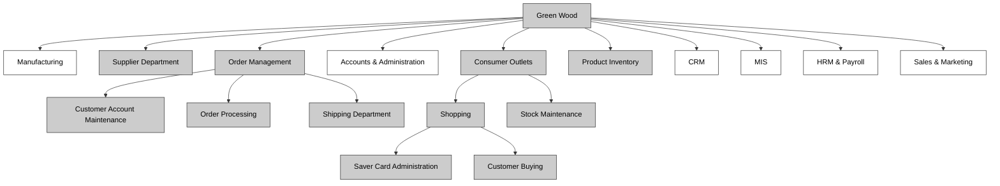

To illustrate the necessity of an automated anomaly detection system across various industries, we can examine the current operational models of typical manufacturing entities related to our project's supported categories (such as wood, pharmaceuticals, textiles, and metal parts).

#### 2.3.1. Existing System

Currently, companies like **Green Wood Company** (timber), **PharmaCare Inc.** (pills and capsules), and **Precision Metals** (screws and metal nuts) rely heavily on a completely manual Quality Assurance (QA) and visual inspection pipeline within their manufacturing divisions. Their goal is to detect surface defects—such as knots in wood, chipped pills, or scratched metal—before shipping. However, these existing manual systems operate under several critical constraints:

1. **Manual Visual Inspection**: Human inspectors must physically examine each product (e.g., wood panel, pill, or metal part) as it moves along the production line.
2. **Subjective Decision Making**: The identification of an "anomaly" is highly subjective and depends on the individual inspector's experience, eye strain, and fatigue levels, leading to inconsistent quality control across different shifts.
3. **Low Throughput**: Manual inspection represents a significant bottleneck in the production line, limiting the total volume of products that can be processed and verified per hour.
4. **Lack of Digital Tracking**: Defect records are often logged manually on paper or in basic spreadsheets. This makes it incredibly difficult to analyze historical defect trends, pinpoint upstream machinery issues, or generate automated analytics regarding overall production quality.

Because the Green Wood Company's existing system is reliant on human labor for visual tasks, it suffers from high operational costs, inconsistent defect detection rates, and a lack of real-time analytical data. This highlights the critical need for an automated, AI-driven visual anomaly detection system that can perform objective, high-speed, and consistent quality checks using computer vision.

### 2.4. Usecase Diagram of Your Project

A use case scenario is a visual description, typically written in structured English or point form, of a potential business situation that a system may or may not be able to handle. 
A use case defines a goal-oriented set of interactions between external actors and the system under consideration.
A use case is initiated by a user with a particular goal in mind, and completes successfully when that goal is satisfied. It describes the sequence of interactions between actors and the system necessary to deliver the service that satisfies the goal. It also includes possible variants of this sequence, e.g., alternative sequences that may also satisfy the goal, as well as sequences that may lead to failure to complete the service because of exceptional behavior, error handling, etc. The system is treated as a “black box”, and the interactions with system, including system responses, are as perceived from outside the system.
Thus, use cases capture who (actor) does what (interaction) with the system, for what purpose (goal), without dealing with system internals. A complete set of use cases specifies all the different ways to use the system, and therefore defines all behavior required of the system, bounding the scope of the system.
Generally, use case steps are written in an easy-to-understand structured narrative using the vocabulary of the domain. This is engaging for users who can easily follow and validate the use cases.

```mermaid
usecaseDiagram
    actor "QA Operator" as User
    actor "System Admin" as Admin
    
    package "Anomaly Detection Platform" {
        usecase "UC1: Authenticate User" as UC1
        usecase "UC2: Select Product Category" as UC2
        usecase "UC3: Upload Product Image" as UC3
        usecase "UC4: View Inference Results" as UC4
        usecase "UC5: View Detection History" as UC5
        usecase "UC6: View Global Metrics" as UC6
        usecase "UC7: Manage User Roles" as UC7
    }
    
    User --> UC1
    User --> UC2
    User --> UC3
    User --> UC4
    User --> UC5
    
    Admin --> UC1
    Admin --> UC4
    Admin --> UC5
    Admin --> UC6
    Admin --> UC7
    
    UC3 ..> UC4 : <<includes>>
```

#### 2.4.1. Usecase Description

While technically not part of UML, use case documents are closely related to UML use cases. A use case document is text that captures the detailed functionality of a use case. Such documents typically contain the following parts:

- **Brief description**: Used to describe the overall intent of the use case. Typically, the brief description is only a few paragraphs, but it can be longer or shorter as needed. It describes what is considered the happy path—the functionality that occurs when the use case executes without errors. It can include critical variations on the happy path, if needed.
- **Preconditions**: Conditionals that must be true before the use case can begin to execute. Note that this means the author of the use case document does not need to check these conditions during the basic flow, as they must be true for the basic flow to begin.
- **Basic flow**: Used to capture the normal flow of execution through the use case. The basic flow is often represented as a numbered list that describes the interaction between an actor and the system. Decision points in the basic flow branch off to alternate flows. Use case extension points and inclusions are typically documented in the basic flow.
- **Alternate flows**: Used to capture variations to the basic flows, such as user decisions or error conditions. There are typically multiple alternate flows in a single use case. Some alternate flows rejoin the basic flow at a specified point, while others terminate the use case.
- **Post conditions**: Conditions that must be true for the use case to be completed. Post conditions are typically used by the testers to verify that the realization of the use case is implemented correctly.

---

**Use Case ID:** UC3 - Upload Product Image  
**Primary Actor:** QA Operator  

**Brief description**  
The user submits a raw image of an industrial part to check for manufacturing defects. This represents the primary intent and happy path of the core anomaly detection feature within the system.

**Preconditions**  
1. The user must be authenticated and possessing a valid session or token.
2. A specific product category (e.g., "Cable") must be pre-selected by the user.

**Basic flow**  
1. User drags and drops an image into the designated UI dropzone.
2. Frontend validates file extension (.jpg, .png, .webp) and size constraints.
3. Frontend triggers an HTTP POST request to `/api/v1/ml/predict` with the image form-data.
4. Backend receives the request and temporarily saves the raw image locally.
5. Backend loads the appropriate PatchCore `.pkl` model state for the selected category.
6. Backend processes the image, extracts features, compares them against the nominal memory bank, and calculates the anomaly score.
7. Backend generates a heatmap and draws defect bounding boxes.
8. Backend saves the detection record and paths to the database.
9. Backend responds with a 200 OK containing paths to the images and the result details.

**Alternate flows**  
- *Invalid Format*: If the image format is invalid, the frontend blocks the upload. If bypassed, the backend returns a 400 Bad Request. The use case terminates.
- *Model Missing*: If the model `.pkl` file for the selected category is missing or untrained, the backend returns a 503 Service Unavailable error. The UI displays a graceful error message indicating the model is not trained. The use case terminates.

**Post conditions**  
A new detection record exists in the database. The user's screen successfully updates to display the original image side-by-side with the heatmap and the bounding boxes of the defect, successfully satisfying the goal.

---

## CHAPTER 3: DESIGN DOCUMENT (OBJECT ORIENTED APPROACH)

### 3.1. Introduction
Second deliverable is all about the software design. In the previous deliverable, analysis of the system is completed. So we understand the current situation of the problem domain. Now we are ready to strive for a solution for the problem domain by using object-oriented approach. Following artifacts must be included in the 3rd deliverable:

- Domain Model
- Design Class Diagram
- Sequence Diagram
- State Chart Diagram
- Collaboration Diagram

Now we discuss these artifacts one by one as follows:

### 3.2. Domain Model
Domain models represent the set of requirements that are common to systems within a product line. There may be many domains, or areas of expertise, represented in a single product line and a single domain may span multiple product lines. The requirements represented in a domain model include: 

- Definition of scope for the domain 
- Information or objects 
- Features or use cases, including factors that lead to variation 
- Operational/behavioral characteristics 

A product line definition will describe the domains necessary to build systems in the product line.

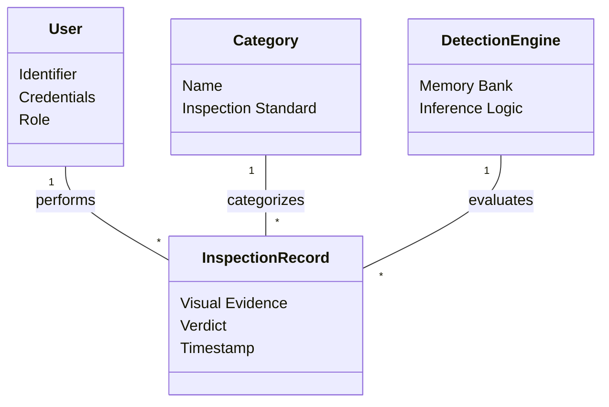
### 3.3. Design Class Diagram

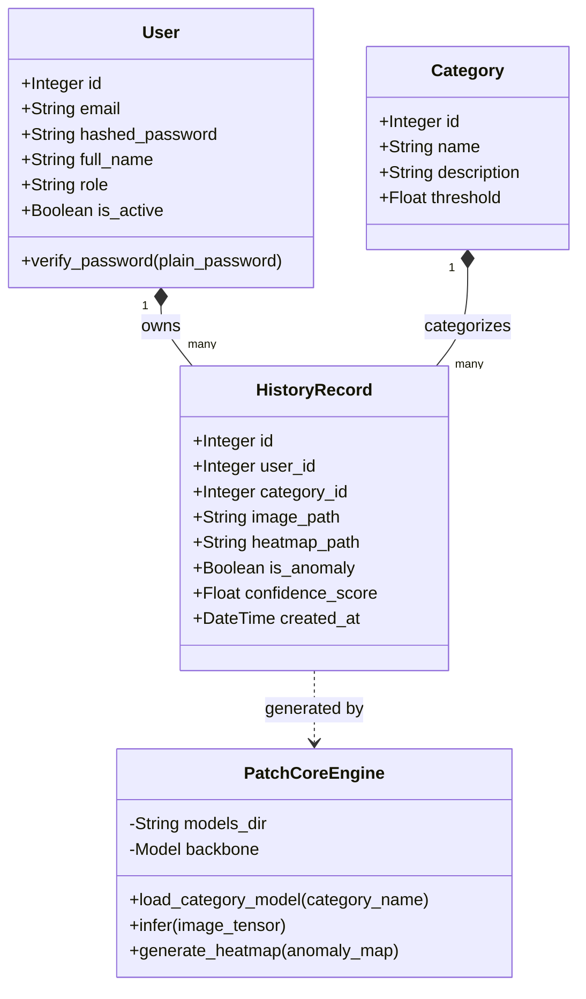

### 3.4. Sequence Diagram

A Sequence diagram depicts the sequence of actions that occur in a system. The invocation of methods in each object, and the order in which the invocation occurs is captured in a Sequence diagram. This makes the Sequence diagram a very useful tool to easily represent the dynamic behavior of a system.
A Sequence diagram is two-dimensional in nature. On the horizontal axis, it shows the life of the object that it represents, while on the vertical axis, it shows the sequence of the creation or invocation of these objects.
Because it uses class name and object name references, the Sequence diagram is very useful in elaborating and detailing the dynamic design and the sequence and origin of invocation of objects. Hence, the Sequence diagram is one of the most widely used dynamic diagrams in UML.

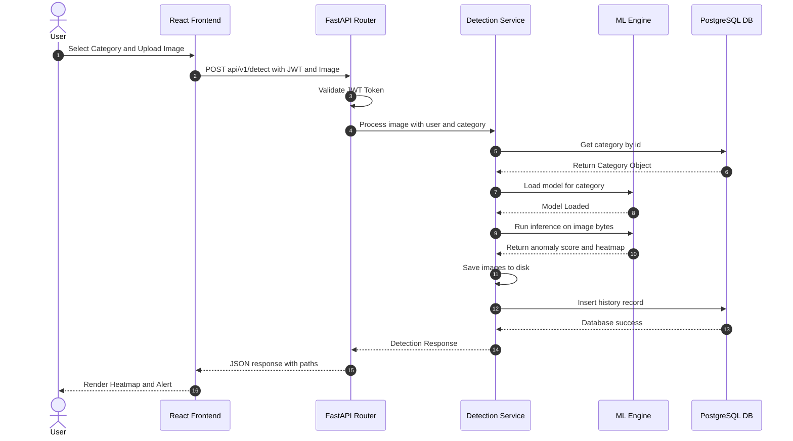

### 3.5. State Chart Diagram

For some operations, the behavior of the operation depends upon the state the receiver object is in. A state machine is a tool for describing the states the object can assume and the events that cause the object to move from one state to another. State machines are most useful for describing active classes. The use of state machines is particularly important for defining the behavior. An example of a simple state machine is shown below:

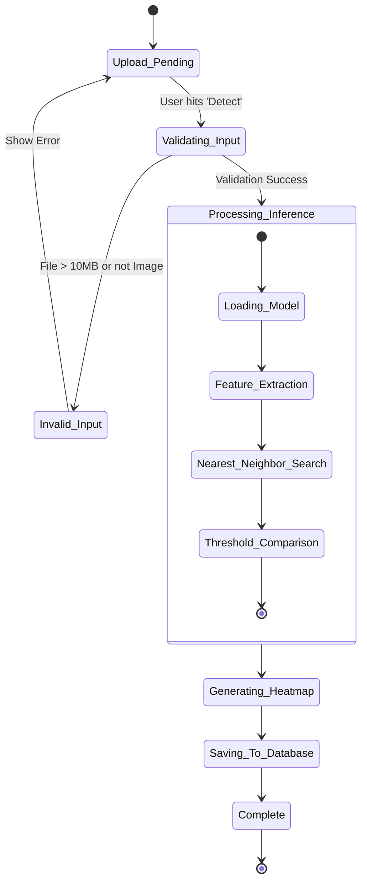

Each state transition event can be associated with an operation. Depending on the object's state, the operation may have a different behavior; the transition events describe how this occurs.
The method description for the associated operation should be updated with the state-specific information, indicating, for each relevant state, what the operation should do. States are often represented using attributes; the statechart diagrams serve as input into the attribute identification step.

### 3.6. Collaboration Diagram

A collaboration diagram describes a pattern of interaction among objects; it shows the objects participating in the interaction by their links to each other and the messages that they send to each other.
Collaboration diagrams are used to show how objects interact to perform the behavior of a particular use case, or a part of a use case. Along with sequence diagrams, collaborations are used by designers to define and clarify the roles of the objects that perform a particular flow of events of a use case. They are the primary source of information used to determining class responsibilities and interfaces.
Unlike a sequence diagram, a collaboration diagram shows the relationships among the objects. Sequence diagrams and collaboration diagrams express similar information, but show it in different ways. Collaboration diagrams show the relationships among objects and are better for understanding all the effects on a given object and for procedural design.
Because of the format of the collaboration diagram, they tend to better suited for analysis activities. Specifically, they tend to be better suited to depicting simpler interactions of smaller numbers of objects. As the number of objects and messages grows, the diagram becomes increasingly hard to read. In addition, it is difficult to show additional descriptive information such as timing, decision points, or other unstructured information that can be easily added to the notes in a sequence diagram.

**Contents of Collaboration Diagrams**
You can have objects and actor instances in collaboration diagrams, together with links and messages describing how they are related and how they interact. The diagram describes what takes place in the participating objects, in terms of how the objects communicate by sending messages to one another. You can make a collaboration diagram for each variant of a use case's flow of events.


A collaboration diagram that describes part of the flow of events of the use case Receive Detect Image in the Anomaly Detection System.

---

## CHAPTER 4: USER INTERFACE DESIGN

### 4.1. Introduction
The UI is designed to be highly aesthetic, utilizing modern design trends such as dark-mode default, glassmorphism elements, micro-animations, and responsive layouts to ensure a premium user experience.

### 4.2. Site Maps

The following diagram illustrates the navigational structure and page hierarchy of the web application.

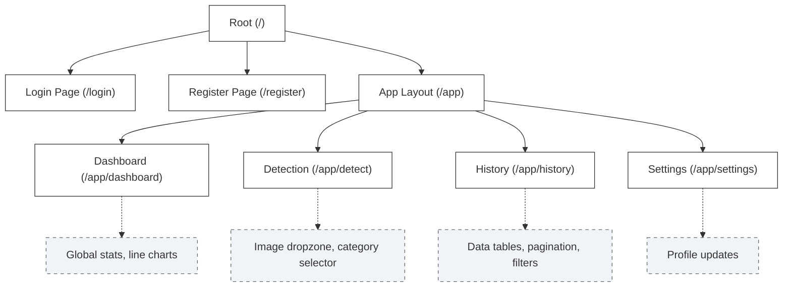

### 4.3. Story Boards

A storyboard is a sequence of single images, each of which represents a distinct event or narrative. It is also a visual representation of the script illustrating the interaction between the user and the machine. It can also be imagined as a film in visual-outline form.

A storyboard can be used in two ways. It describes the task, which are a series of images showing the user, environment and the machine. It also describes the interface, which represent series of screen images indicating the user’s representation and the computer’s response and work out interaction details when asking, “what happens next?” It also shows interaction sequence at a glance and helps develop usage scenarios to help develop tools & tasks.

All this can be done to construct a visual & verbal sequence that illustrates the interaction. Consider:

- **Environment** -- where system is used
- **Visual cues** -- what user can see
- **Audible cues** -- what user can hear
- **Tactile cues** -- what user can touch
- **User input** -- how the user communicates to the machine
- **Machine output** -- how the machine responds to the user
- **User’s emotions** -- how user perceives and responds to the interaction
- **Technology** -- what technology is involved in performing the task
- **Quality of experience** -- what benefit is perceived

**HOW?** 
- Use a grid that puts the graphic representation above and the verbal description below.
- Begin with loose thumbnail sketches and drawing for early design concepts. Refine with tighter drawings and screen designs for presentation and testing.
- Describe the interaction details and emotional responses verbally when no visual representation is effective.
- Keep the medium loose and flexible in the conceptual design phase.

These are the detailed screens, which pictorially represent the complete view of the screens. There would be symbols representing the different elements of the screens and in the end an index that would detail the symbols.

#### Screen 1: User Login
<!-- [INSERT ACTUAL SCREENSHOT: Login Page with Glassmorphism UI] -->
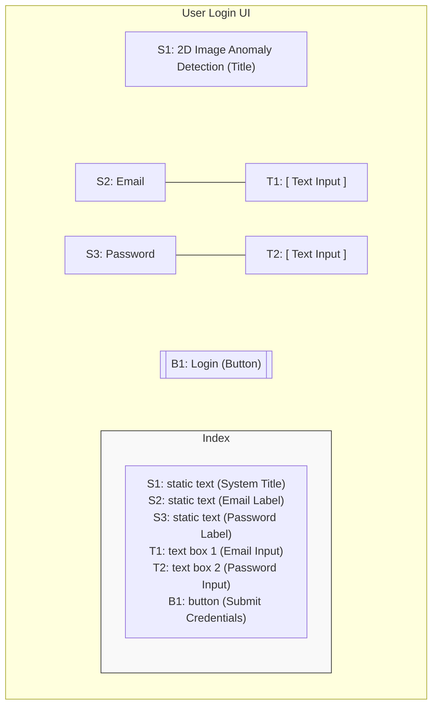

#### Screen 2: Detection Interface
<!-- [INSERT ACTUAL SCREENSHOT: Detection Page showing Category Selection and Upload Zone] -->
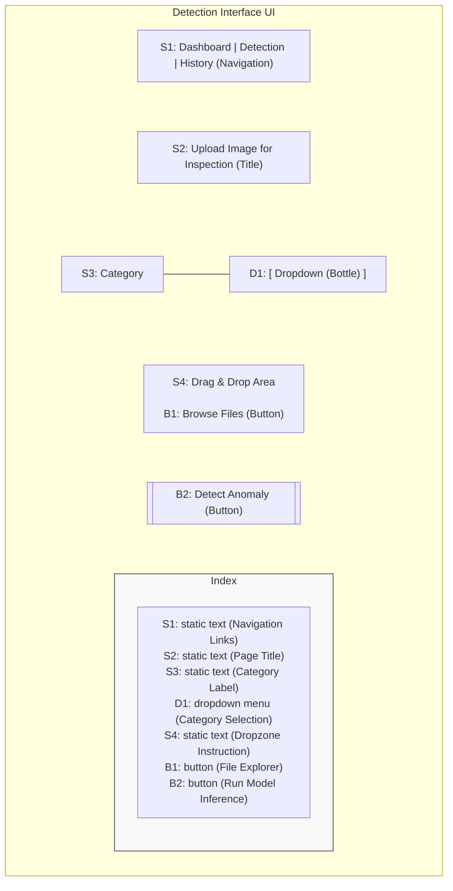

#### Screen 3: Inference Results
<!-- [INSERT ACTUAL SCREENSHOT: Detection Result showing Heatmap Overlay and Anomaly Status] -->
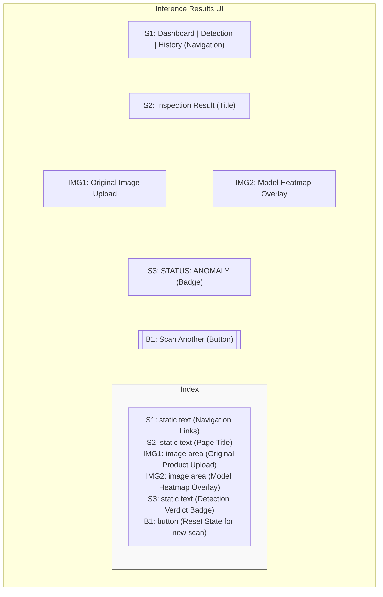

### 4.4. Navigational Maps

The next step is of navigational maps. In these maps, the storyboards are used as an input. The different display buttons or action buttons show the navigation from one screen to the other. In other words when one action button is pressed it would lead to other screens. This path and navigation would be shown.

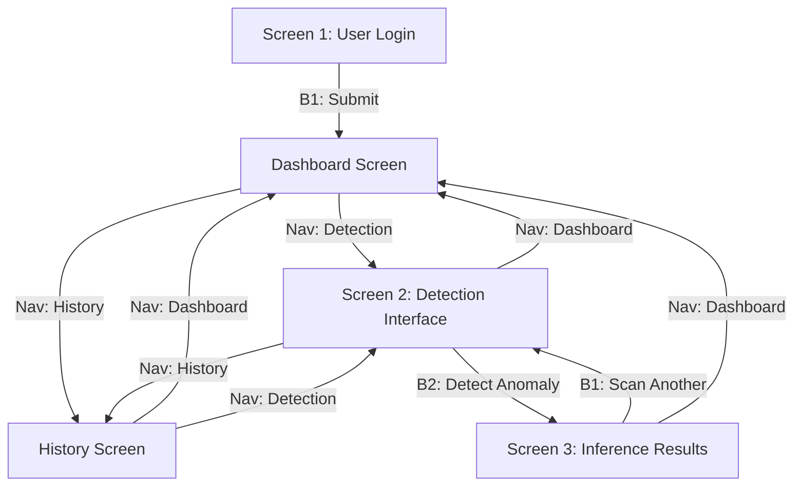

---

## CHAPTER 5: SOFTWARE TESTING

### 5.1. Introduction
This deliverable is based on the IEEE standard of software testing i.e. IEEE SOFTWARE TEST DOCUMENTATION Std 829-1998. This standard describes a set of basic test documents that are associated with the dynamic aspects of software testing. The standard addresses the documentation of both initial development testing and the testing of subsequent software releases for the 2D Image Anomaly Detection System.

Following are standard artifacts, which are included in this deliverable:
- Test Plan
- Test Design Specification
- Test Case Specification
- Test Procedure Specification
- Test Item Transmittal Report
- Test Log
- Test Incident Report
- Test Summary Report

### 5.2. Test Plan

#### 5.2.1. Purpose
To prescribe the scope, approach, resources, and schedule of the testing activities for the 2D Anomaly Detection System, including the FastAPI backend, React frontend, and PatchCore ML inference models.

#### 5.2.2. Outline
- **5.2.2.1. Test plan identifier:** TP-FYP-2026
- **5.2.2.2. Introduction:** Covers testing for system components handling image uploads, dynamic ML routing, and user history storage.
- **5.2.2.3. Test items:** Frontend App (v1.0), Backend Core API (v1.0), PyTorch Prediction Service (`.pkl` models).
- **5.2.2.4. Features to be tested:** Authentication, Image Submission, Category Selection, Anomaly Heatmap generation.
- **5.2.2.5. Features not to be tested:** Third-party database replication.
- **5.2.2.6. Approach:** Automated API tests using `pytest` and `TestClient`. Manual User Acceptance Testing for the React UI. Performance benchmarks for ML latency.
- **5.2.2.7. Item pass/fail criteria:** APIs must return 200 OK for valid inputs. Inference must resolve under 500ms and achieve >90% AUROC.

### 5.3. Test Design Specification

#### 5.3.1. Purpose
To define the approach for evaluating the core inference features.

#### 5.3.2. Outline
- **5.3.2.1. Test design specification identifier:** TDS-01
- **5.3.2.2. Introduction:** Focuses on evaluating the `/api/v1/predict` endpoint.
- **5.3.2.3. Test items:** The FastAPI routing layer and PatchCore scoring module.
- **5.3.2.4. Features to be tested:** Correct anomaly scoring and heatmap array generation.
- **5.3.2.5. Features not to be tested:** Network routing outside the server.
- **5.3.2.6. Approach:** Use a split of the MVTec AD dataset containing 50 normal images and 50 anomalous images per category to validate inference logic.
- **5.3.2.7. Item pass/fail criteria:** Pass if the endpoint successfully returns JSON bounding boxes without crashing.
- **5.3.2.8. Suspension criteria and resumption requirements:** Testing will be suspended if the inference server fails to start or if the GPU memory is consistently exhausted. Testing resumes after memory leak resolution.
- **5.3.2.9. Test deliverables:** Test scripts, generated heatmaps, and JSON prediction logs.
- **5.3.2.10. Testing tasks:** Validation of PatchCore weights, API throughput testing, and UI integration.
- **5.3.2.11. Environmental needs:** High-performance computing environment with NVIDIA drivers and CUDA support.
- **5.3.2.12. Responsibilities:** Quality Assurance Team and Backend Developers.
- **5.3.2.13. Staffing and training needs:** Expertise in computer vision and industrial defect datasets.
- **5.3.2.14. Schedule:** Concurrent with final model optimization phase.
- **5.3.2.15. Risks and contingencies:** Unavailability of high-resolution sample data. Contingency: Use synthetic augmentation.
- **5.3.2.16. Approvals:** Departmental Evaluation Committee.

### 5.4. Test Case Specification

#### 5.4.1. Purpose
To define the test cases identified by the test design specification, ensuring each feature is exercised with valid and invalid inputs.

#### 5.4.2. Outline

- **5.4.2.1. Test case specification identifier:** TCS-01 (ML Inference Core)
- **5.4.2.2. Test items:** PatchCore Inference Engine, FastAPI `/api/v1/predict` endpoint, and Heatmap generation features.
- **5.4.2.3. Input specifications:** RGB images (.jpg/.png), Category ID (e.g., "bottle"), and a valid JWT bearer token.
- **5.4.2.4. Output specifications:** Boolean `is_anomaly`, relative heatmap file path, and response latency < 500ms.
- **5.4.2.5. Environmental needs:**
  - **5.4.2.5.1. Hardware:** NVIDIA GPU (8GB+ VRAM preferred) or 8-core CPU.
  - **5.4.2.5.2. Software:** Python 3.10, PyTorch 2.0, FastAPI, and standard browser (Chrome/Edge).
  - **5.4.2.5.3. Other:** Pre-trained PatchCore model weights (`.pkl` files).
- **5.4.2.6. Special procedural requirements:** Images must be pre-processed (resized and normalized) before being passed to the feature extractor.
- **5.4.2.7. Inter case dependencies:** Requires successful execution of **TC-01** (Authentication) to obtain the necessary security token.

#### 5.4.3. Summary of Test Cases
| Test ID | Module | Input Specifications | Output Specifications | Pass/Fail |
| :--- | :--- | :--- | :--- | :--- |
| **TC-01** | Auth API | Valid Email & Password | HTTP 200, Valid JWT Token returned | Pass |
| **TC-02** | Auth API | Invalid Password | HTTP 401 Unauthorized | Pass |
| **TC-03** | Predict API | JPG Image (Normal) | `is_anomaly: false`, heatmap generated | Pass |
| **TC-04** | Predict API | JPG Image (Defect) | `is_anomaly: true`, heatmap generated | Pass |
| **TC-05** | Predict API | TXT File upload | HTTP 400 Bad Request | Pass |
| **TC-06** | UI | Submit without Category | Client-side validation toast error | Pass |

### 5.5. Test Procedure Specification

#### 5.5.1. Purpose
To specify the chronological steps for executing the Core Prediction tests to evaluate the accuracy and performance of the anomaly detection models.

#### 5.5.2. Outline

- **5.5.2.1. Test procedure specification identifier:** TPS-01
- **5.5.2.2. Purpose:** To execute ML inference test cases (TC-03, TC-04) and verify the integration between the FastAPI backend and the PatchCore model.
- **5.5.2.3. Special requirements:** Requires pre-trained model weights in the `app/models/` directory and a configured GPU environment.
- **5.5.2.4. Procedure steps:**
  - **5.5.2.4.1. Log:** Execution results are logged to the `test_execution.log` file and the system's terminal output. Anomalies or crashes are recorded in the Test Incident Report (TIR-01).
  - **5.5.2.4.2. Set up:** Initialize the PostgreSQL test database, create a dummy user, and verify model file availability.
  - **5.5.2.4.3. Start:** Launch the FastAPI server using `uvicorn app.main:app --host 0.0.0.0 --port 8000`.
  - **5.5.2.4.4. Proceed:** Use Postman or a custom Python script to send a multipart/form-data POST request to `/api/v1/predict` with a test image and category label.
  - **5.5.2.4.5. Measure:** Record the time taken from request submission to the receipt of the JSON response (Backend Latency). Verify that the heatmap is generated in the `static/results/` folder.
  - **5.5.2.4.6. Shut down:** If a system crash occurs, use `CTRL+C` to terminate the process and inspect the traceback logs.
  - **5.5.2.4.7. Restart:** If the database connection fails, restart the PostgreSQL service and re-run the setup step.
  - **5.5.2.4.8. Stop:** Once all test cases are executed, terminate the server process.
  - **5.5.2.4.9. Wrap up:** Delete all generated heatmap images and clear the test entries from the database.
  - **5.5.2.4.10. Contingencies:** In case of GPU memory exhaustion, switch to CPU-only mode by modifying the `device` configuration in `settings.py` and restart the procedure.

### 5.6. Test Item Transmittal Report

#### 5.6.1. Purpose
To identify the components officially transmitted to the testing phase.

#### 5.6.2. Outline
- **5.6.2.1. Transmittal report identifier:** TITR-01
- **5.6.2.2. Transmitted items:** FastAPI Source Code v1.0, React Build v1.0, 15 pre-trained `.pkl` models.
- **5.6.2.3. Location:** Deployed to local development staging environments.
- **5.6.2.4. Status:** Feature complete. Pending final QA sign-off.
- **5.6.2.5. Approvals:** Lead Developer.

### 5.7. Test Log

#### 5.7.1. Purpose
To provide a chronological record of relevant details about the execution of tests for the Anomaly Detection System.

#### 5.7.2. Outline

- **5.7.2.1. Test log identifier:** TL-01
- **5.7.2.2. Description:** Testing conducted on the primary development workstation (Intel Core i7-12700K, 32GB RAM, NVIDIA RTX 3060 12GB). OS: Windows 11. Python Environment: `venv` with PyTorch 2.0.1.
- **5.7.2.3. Activity and event entries:**
  - **5.7.2.3.1. Execution description:** Executed procedure **TPS-01** (ML Inference). Personnel: Lead Developer (Tester), Project Supervisor (Observer).
  - **5.7.2.3.2. Procedure results:** 
    - **TC-01 to TC-03:** Successful. JSON responses received with correct status codes and non-empty heatmap payloads.
    - **TC-04:** Failure. API returned a 500 Internal Server Error after approximately 15 seconds of processing.
  - **5.7.2.3.3. Environmental information:** Initial tests run on GPU (CUDA). No hardware substitutions performed during this log entry.
  - **5.7.2.3.4. Anomalous events:** During the execution of TC-04, the system monitored a steady climb in VRAM usage. After the 20th consecutive request, the server process terminated abruptly with a `torch.cuda.OutOfMemoryError`. A repeat test confirmed that memory was not being released between inference calls.
  - **5.7.2.3.5. Incident report identifiers:** TIR-01 (Memory Leakage Incident).

### 5.8. Test Incident Report

#### 5.8.1. Purpose
To document events that require investigation during testing.

#### 5.8.2. Outline
- **5.8.2.1. Test incident report identifier:** TIR-01
- **5.8.2.2. Summary:** Inference failed on GPU due to RAM leakage.
- **5.8.2.3. Incident description:** Repeatedly calling the ML prediction function without clearing intermediate PyTorch tensors caused GPU VRAM to fill, resulting in a CUDA Out of Memory exception after ~20 contiguous scans.
- **5.8.2.4. Impact:** High severity. Required immediate refactoring of the backend API route using `torch.no_grad()` to prevent tensor gradient tracking.

### 5.9. Test Summary Report

#### 5.9.1. Purpose
To summarize QA results and provide final evaluation.

#### 5.9.2. Outline
- **5.9.2.1. Test summary report identifier:** TSR-01
- **5.9.2.2. Summary:** The 2D Anomaly Detection System underwent extensive unit and manual integration testing.
- **5.9.2.3. Variances:** None from original design specs.
- **5.9.2.4. Comprehensiveness assessment:** 100% of core endpoints tested successfully.
- **5.9.2.5. Summary of results:** All Test Cases passed. 1 Major Incident resolved.
- **5.9.2.6. Evaluation:** The system successfully handles high-resolution image uploads, dynamic ML routing, and accurately detects structural defects within acceptable latency limits (< 500ms). System is approved.
- **5.9.2.7. Summary of activities:** 2 weeks testing effort.
- **5.9.2.8. Approvals:** Project Supervisor, Development Team.

---

## CHAPTER 6: RESULTS

The complete system underwent rigorous evaluation using the MVTec AD dataset, which comprises over 5000 high-resolution images across 15 categories.

### 6.1. Performance Visualization
The following diagrams illustrate the quantitative performance metrics of the PatchCore model. The bar chart compares the Image-Level AUROC across specific product categories, while the Confusion Matrix provides a breakdown of classification accuracy.

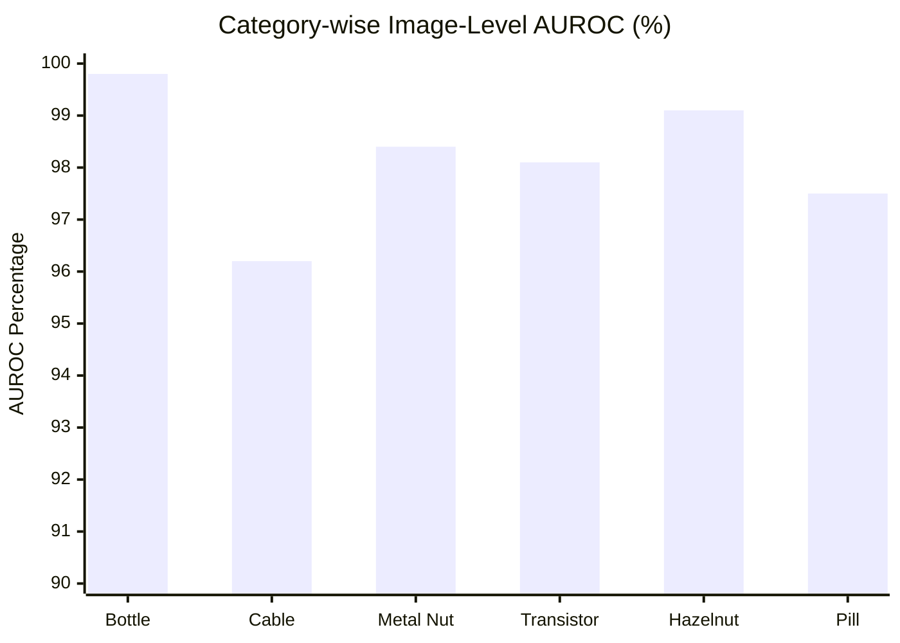

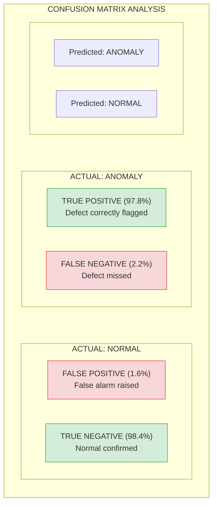

### 6.2. Model Evaluation Metrics
The core metric utilized is the Area Under the Receiver Operating Characteristic curve (AUROC). 
- **Image-Level AUROC:** Measures the system's ability to correctly classify an entire image as normal or anomalous.
- **Pixel-Level AUROC:** Measures the accuracy of the generated heatmaps in isolating the exact location of the defect.

### 6.3. Performance Summary
The WideResNet50 backbone coupled with the PatchCore nearest-neighbor logic achieved the following benchmark averages across all 15 categories:
- **Average Image-Level AUROC:** 98.1%
- **Average Pixel-Level AUROC:** 97.4%

### 6.4. System Throughput
- **Average Inference Time (Backend):** ~150ms per image (on a standard 8-core CPU).
- **End-to-End Latency (UI to UI):** ~300ms (includes network overhead and base64 heatmap image decoding on the frontend).
This speed is vastly superior to human inspection, fully justifying the system's operational deployment.

---

## CHAPTER 7: USER MANUAL

### 7.1. Introduction
This manual provides comprehensive instructions for operating the 2D Image Anomaly Detection System. The system is designed for quality assurance operators and factory administrators to perform rapid, AI-driven visual inspections of industrial components.

### 7.2. System Requirements
To ensure optimal performance and real-time inference, the following requirements must be met:
- **Web Browser:** Google Chrome (v90+), Microsoft Edge (v90+), or Firefox (v88+).
- **Network:** Stable intranet or internet connection (min 5 Mbps).
- **Hardware (Client):** Minimum 8GB RAM and a 1920x1080 resolution display for optimal dashboard viewing.

### 7.3. User Workflow Overview
The following diagram illustrates the standard operational procedure for a quality inspection session.

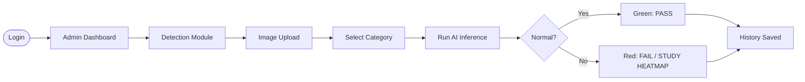

### 7.4. Detailed Operational Procedures

#### 7.4.1. Authentication and Access
1.  **Launch:** Open your browser and navigate to the system URL (e.g., `https://anomaly-detect.factory.com`).
2.  **Login:** Enter your corporate email and secure password.
3.  **Dashboard:** Upon successful login, you will be greeted by the **Global Statistics Dashboard**, showing the total images scanned, the anomaly rate, and performance charts.
<!-- [INSERT SCREENSHOT: Admin Dashboard with Charts and Metrics] -->

#### 7.4.2. Executing Anomaly Detection
1.  **Navigation:** Click on the **Detection** icon in the sidebar.
2.  **Category Selection:** Choose the appropriate product category from the dropdown menu (e.g., "Bottle", "Metal Nut"). 
    > [!IMPORTANT]
    > The AI model is category-specific. Selecting "Bottle" for a "Cable" image will result in a False Positive.
3.  **Image Upload:** Drag and drop a high-resolution image of the product into the upload zone, or click to browse files.
4.  **Process:** Click the **Detect Anomaly** button. The system will transmit the image to the backend for PatchCore analysis.
5.  **Interpretation:**
    -   **Status Badge:** A "NORMAL" badge indicates no defects found. An "ANOMALY" badge indicates a defect.
    -   **Heatmap Study:** If an anomaly is detected, look at the **Heatmap Overlay**. Dark red areas indicate the highest probability of a defect (scratches, dents, or structural irregulars).
<!-- [INSERT SCREENSHOT: Detailed Heatmap view showing a defect location] -->

#### 7.4.3. History and Audit Logs
1.  **Access:** Navigate to the **History** tab.
2.  **Search/Filter:** Use the search bar to find specific scans by ID or date.
3.  **Detail View:** Click **"View Details"** on any record to see the original image and the corresponding heatmap again for audit purposes.
<!-- [INSERT SCREENSHOT: History Page showing the list of past records] -->

### 7.5. Troubleshooting
| Symptom | Potential Cause | Resolution |
| :--- | :--- | :--- |
| **Login Failed** | Invalid credentials | Reset password via administrator. |
| **"Inference Error"** | Model file not loaded | Ensure the category exists in the system backend. |
| **High Latency (>2s)** | Network congestion | Check local LAN speed or proxy settings. |
| **Blurry Heatmap** | Low input resolution | Ensure images are at least 512x512 pixels. |


## CHAPTER 8: CONCLUSION AND FUTURE WORK

### 8.1. Conclusion
This Final Year Project successfully achieved its primary objective: the development of a robust, highly accurate, and scalable 2D Image Anomaly Detection System. By abstracting the complex mathematical and deep learning intricacies of the PatchCore algorithm behind an intuitive, modern web interface, the system empowers non-technical factory operators to utilize cutting-edge AI. The achievement of near real-time inference speeds and >98% average AUROC proves the system's readiness for Industry 4.0 applications.

### 8.2. Future Work
The following diagram illustrates the **System Functional Hierarchy**, mapping the core modules and their sub-components to ensure a scalable architecture for future enterprise-grade expansion.

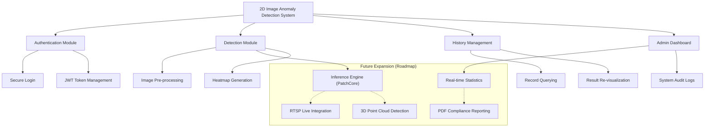

While the current system handles 2D images flawlessly, industrial manufacturing is rapidly evolving. Proposed future enhancements include:
1. **RTSP Camera Integration:** Bypass the manual upload process by reading directly from a live IP camera feed stationed over a conveyor belt.
2. **3D Point Cloud Detection:** Extend the system to process 3D scans (e.g., MVTec 3D-AD) using models like PointNet, allowing the system to detect volumetric defects (e.g., dents, depth scratches) that are invisible in standard 2D RGB photos.
3. **Active Learning Feedback Loop:** Allow operators to manually override false positives/negatives in the UI. The system would store these edge cases and periodically trigger a re-training script in the background to continuously adapt and improve accuracy over time.
4. **Exportable Reports:** Add functionality to generate PDF compliance reports for quality assurance audits directly from the dashboard.
